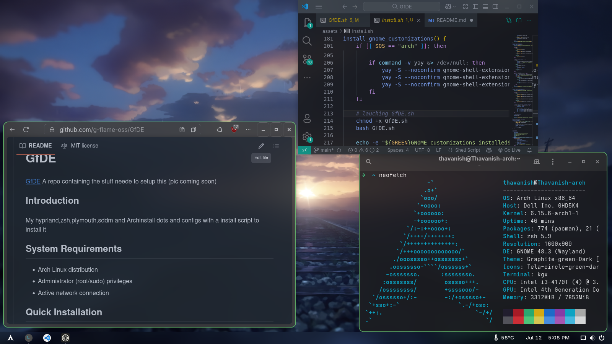

# GfDE


A repository containing everything you need to set up this environment.

---

## Quick Installation

To get started quickly, run the following command in your terminal:

```bash
bash <(curl -s https://raw.githubusercontent.com/g-flame-oss/GfDE/refs/heads/main/clone.sh)
```

---

## Post-Installation Setup
> [!IMPORTANT]
> Please reboot before doing this setup!


After running the install script, follow the guide below to set up the recommended GNOME extensions:

### [GNOME Extensions Setup Guide](assets/extension/setup.md)
### [Theme & Icons Setup Guide](assets/theme/theme-setup.md)

---

## Contributors

- Original Project:  
- GfDE Developer: [G-flame](https://github.com/g-flame)

---

## Credits

- GNOME and GNOME Extensions are developed by the [GNOME Project](https://www.gnome.org/) and their respective extension authors.  
- This setup uses third-party GNOME Shell extensions. Please see each extension's page for individual credits.

---

## License

This project is licensed under the [MIT License](LICENSE)
