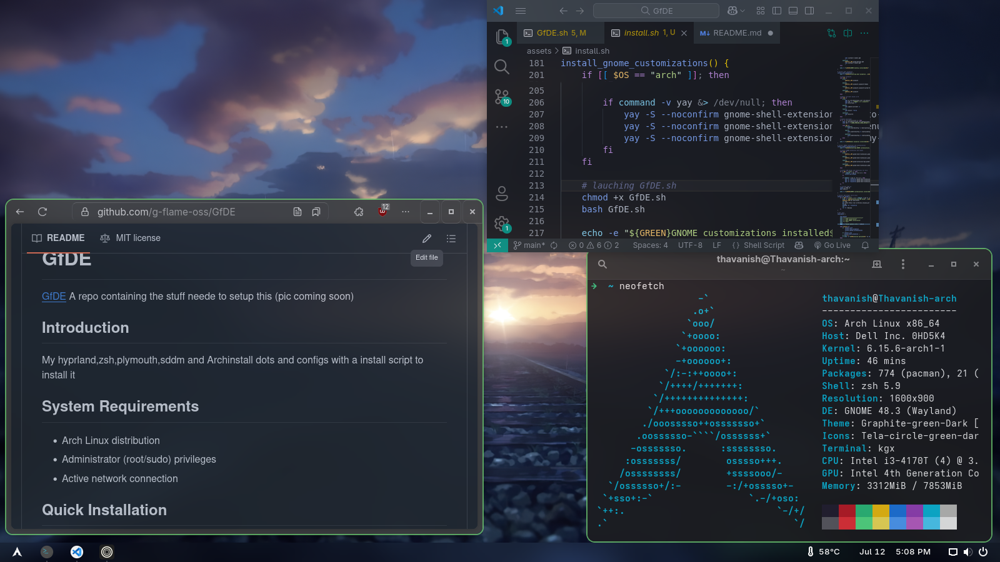
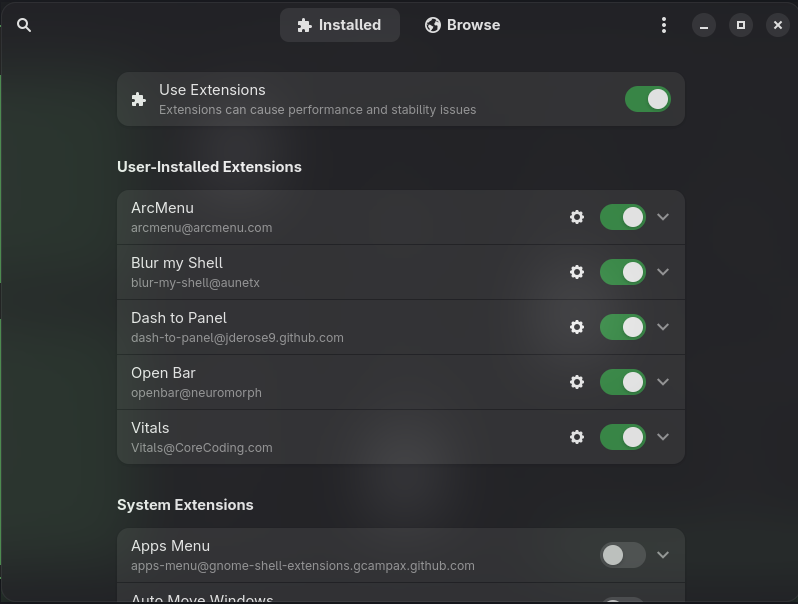
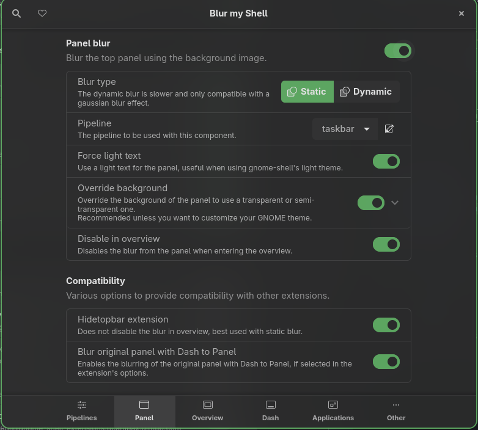
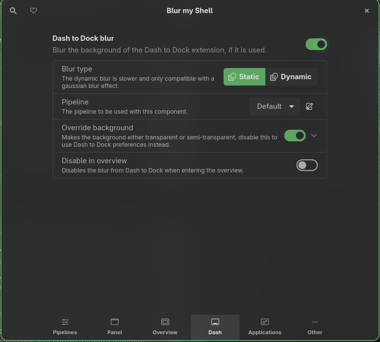
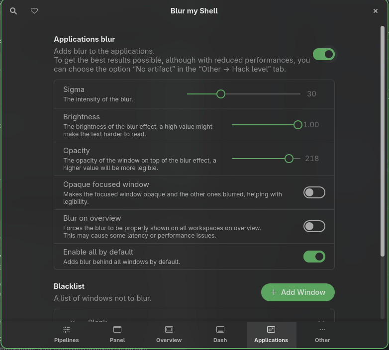
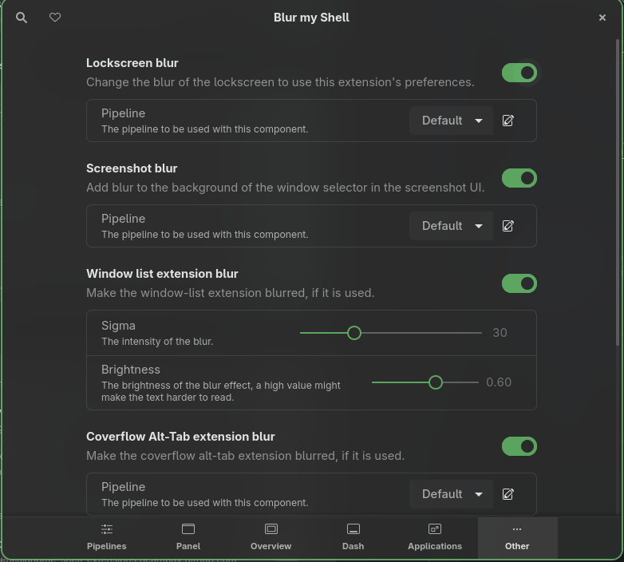
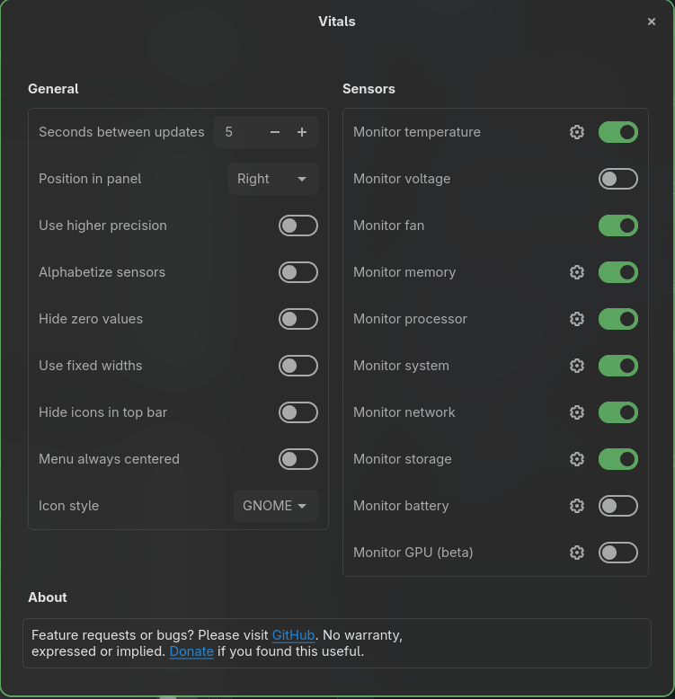
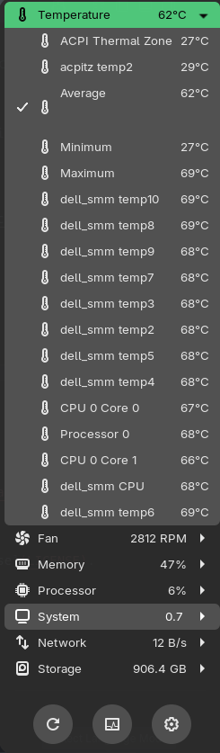

# GNOME Extensions Setup Guide

A step-by-step guide to configure the GNOME extensions used in this setup.

> [!IMPORTANT]
> Please reboot after installation.

---

## Extensions to Install

- [Extension Manager](https://mattjakeman.com/apps/extension-manager)
- Arc Menu
- Blur My Shell
- Dash to Panel
- Open Bar
- Vitals

---

## Configuration Steps

### 0. Extension Manager

Install the above extensions using Extension Manager.  
To configure an extension, click the gear icon next to it.

---

### 1. Arc Menu

Go to Extension Manager → Arc Menu settings → About → Load.  
Import the configuration file below:

[arcmenu-conf](guide-assets/arcmenu-conf)

---

### 2. Blur My Shell

Follow the steps below to configure Blur My Shell:

- **Step 1:**  
  Go to Extension Manager → Blur My Shell → Pipelines → Add Pipeline → Add Effects → Native Gaussian Blur.  
  Set the options as shown:  
  

- **Step 2:**  
  Go to Extension Manager → Blur My Shell → Panel.  
  Set the options as shown:  
  

- **Step 3:**  
  Go to Extension Manager → Blur My Shell → Panel.  
  Set the options as shown:  
  

- **Step 4:**  
  Go to Extension Manager → Blur My Shell → Dash.  
  Set the options as shown:  
  

- **Step 5:**  
  Go to Extension Manager → Blur My Shell → Other.  
  Set the options as shown:  
  

---

### 3. Dash to Panel

Go to Extension Manager → Dash to Panel settings → About → Import from file.  
Import the configuration file below:

[dashtopanel-conf](guide-assets/dashtopanel-conf)

---

### 4. Open Bar

Go to Extension Manager → Open Bar settings → Settings Admin → Import.  
Import the configuration file below:

[openbar-conf](guide-assets/openbar-conf)

---

### 5. Vitals

Follow the steps below to configure Vitals:

- **Step 1:**  
  Go to Extension Manager → Vitals settings.  
  Set the options as shown:  
  

- **Step 2:**  
  Click the Vitals icon in the top bar (or bottom bar if moved).  
  Click on Temperature, select Average, and untick all other fields.  
  

---

## Credits

- Guide by [thavanish](https://github.com/thavanish)
- Project by [G-flame](https://github.com/g-flame)
- GNOME and GNOME Extensions are developed by the [GNOME Project](https://www.gnome.org/) and their respective extension authors.

