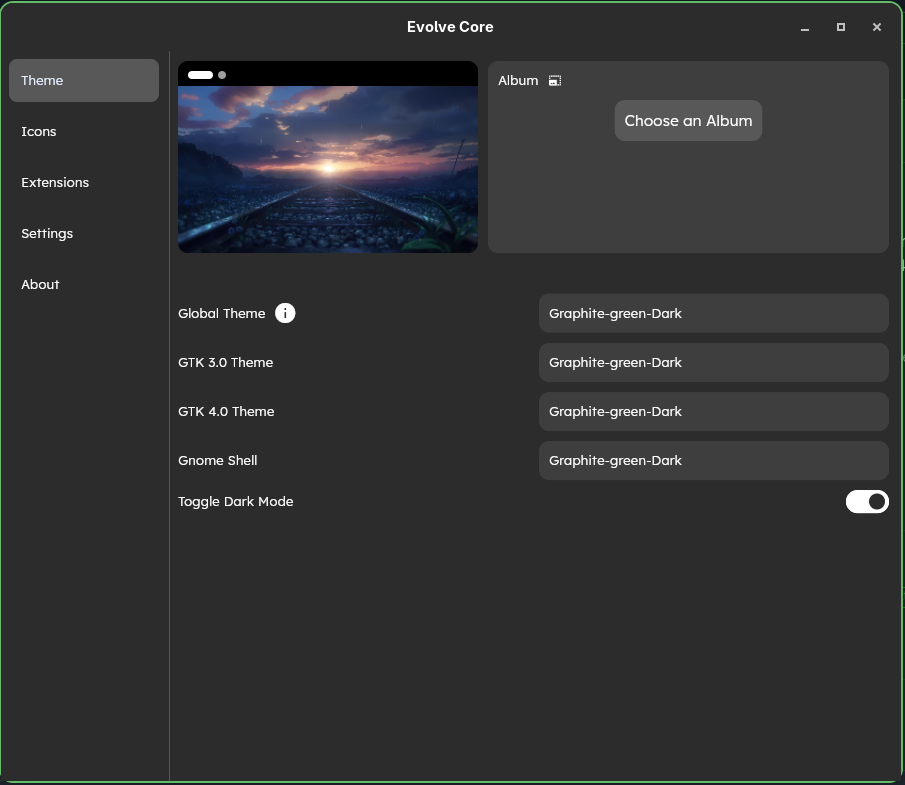
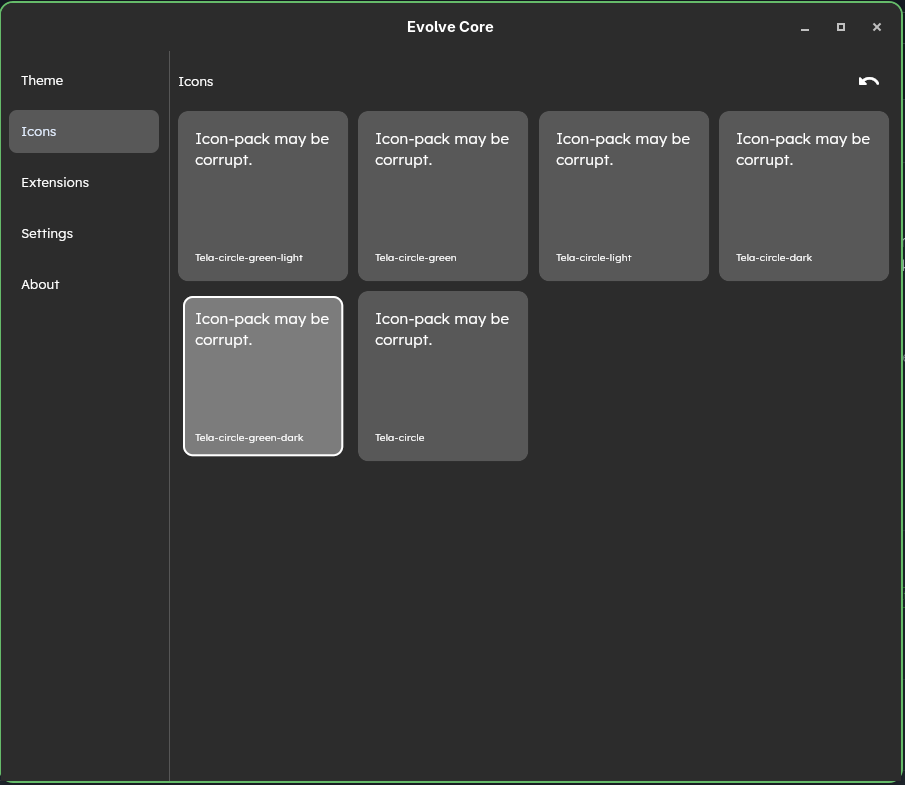

# GNOME Theme Setup Guide

A step-by-step guide to configure the GNOME Gtk theme and icon packs used in this setup.

> [!IMPORTANT]
> Please reboot after installation!

---

## Apps to Install

#### [Evolve-core](https://mattjakeman.com/apps/extension-manager)
---

## Configuration Steps
### 0. install
###### install the evolve core app and open it!!
### 1. Evolve Core 

**Follow the images below to set it up:**

- Step 1  
##### click on Global theme and select **Graphite-green-dark**
  
- Step 2  
##### click on Icons and select **Teal-circle-green-dark**
  
- step 3
#### reboot
---
